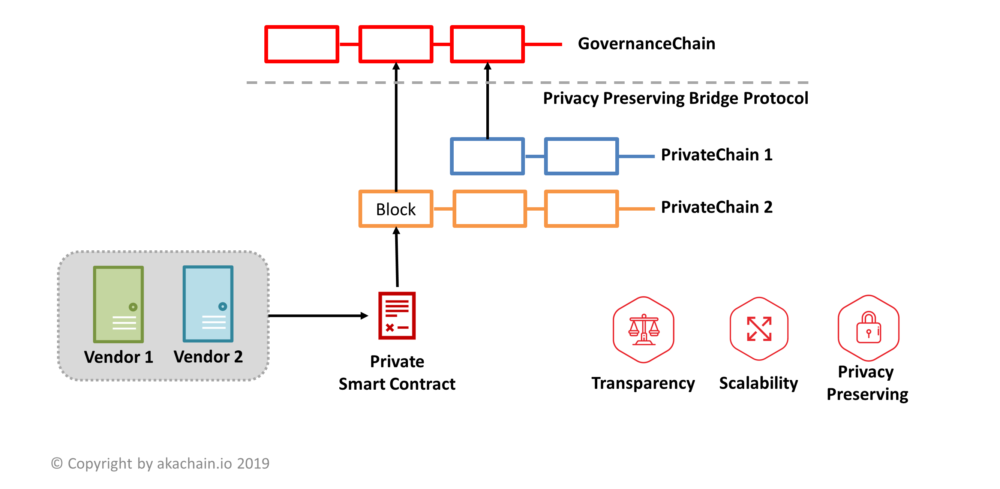

3. High Level Blockchain Architecture
=====================================

Akachain provides a blockchain network that includes multiple separated consortium blockchains that can be linked together if they need. 

On a high level, the Akachain network includes 3 main components:

1. Private Chain: Each consortium of peers forms a private blockchain network. This follows the normal Hyperledger Fabric model. Each private chain is a separated distributed ledger system where peers interact with each others via private smart contracts.

2. Governance Chain: Akachain provides an intermediate Governance Chain that allows any **Endorsing Peer** from any PrivateChain to join. The Governance Chain is a public permissioned blockchain that stores transaction proof as well as encrypted meta data from other private chains.

3. Privacy Preserving Bridge Protocol: We develop a customized protocol to link private chains and Governance Chain together. 

3.1. Private Chain
------------------

3.2. Governance Chain
---------------------

3.3. Bridge Protocol
--------------------
