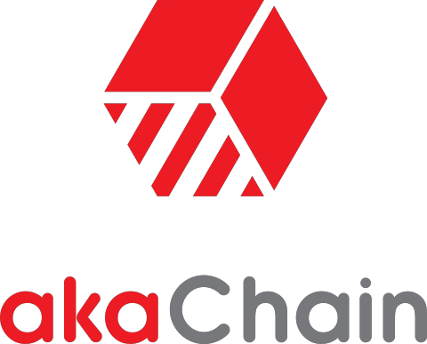

A Blockchain-as-a-Service solution for the Enterprise
=====================================================

For a long time, along with the growth of crypto currencies such as Bitcoin or Ethereum, Blockchain technology has rapidly gained attention of enterprises seeking on how to apply it to other domain beyond financial transactions such as `distributed storage <https://filecoin.io>`_ or `Internet of Things <https://www.iota.org/>`_. However, even when we have blockchain suitable use case, employing such technology is not a trivial task. 

We have seen little success with either public or private blockchain on different domains. The public are raising many questions on the actual outcome of the blockchain technology after so much investment and research efforts. Scholars pointed out `one of the many reasons <https://twitter.com/random_walker/status/1079761433011908608>`_ for this slow adaptation: 

"Open platforms can’t win by directly appealing to users on philosophical grounds, or even cost (see Linux on the desktop). Mainstream users have no good reason to directly interact with blockchain technology—or any piece of code—without intermediaries involved ...". 

Indeed, we have to consider that many of the current blockchain technology platforms are too complex for mainstream users. Even to technology companies, successfully employing the blockchain technology  impose great challenges both in term of economy as well as technical issues.

Inspired by such challenges, we introduce `Akachain <https://akachain.io/>`_, a blockchain-as-a-service solution that brings the power of the blockchain to modern businesses. Akachain simplifies the development and managing a private blockchain system by providing automatic deployment solution on different cloud infrastructure, ready-made business application templates and professional support services.

.. toctree::
    :maxdepth: 2
    
    intro
    landscape

.. note:: If you have questions that are not addressed by this documentation, please send us an email at: admin@akachain.io