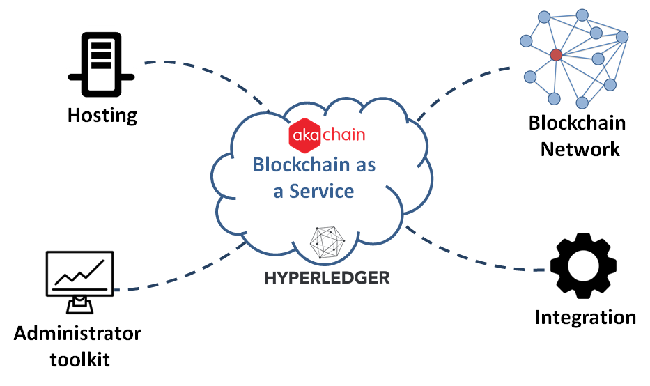

Introduction    
============

Akachain provides a Blockchain as a Service platform allowing developers quickly build and test their blockchain applications without worrying about the blockchain network layer. In particular, Akachain provides a number of core services:

1. Hosting: using the Akachain platform, a developer can quickly deploy a consortium blockchain network (Hyperledger Fabric) on AWS cloud environment. Other clouds support (Azure or on-premis cloud) is coming in late 2019.

2. Blockchain Network: Akachain provides a secure protocol allowing seperated private Fabric network to link together. Thus, it allows specific transactions in a private network can be verified by other private networks as they need. 

3. Administrator Toolkit: The Akachain platforms offers a number of adminstration tools that help developers to automate their develop, deployment or monitor their blockchain network and applications.

4. Integration: Akachain provides a number of industry solutions and template services allowing businesses and enterprises quickly integrate blockchain applications with their existing systems.

Platform landscape
==================
.. image:: images/services.png 
            :height: 400px

The Akachain Plaform includes 3 core layers as depicted in the picture above.

1. Blockchain core
------------------

At the lowest layer, the Akachain platform runs on top of **Hyperledger Fabric**. 
Each business runs their own private Distributed Ledger, either hosted on Amazon Web Service or on-premise cloud. 

Akachain provides centralized Ordering Service using Apache Kafka and Identity Service using RootCA to reduce the cost of running those individual ledgers. However, it is possible for businesses to run their own Ordering service  