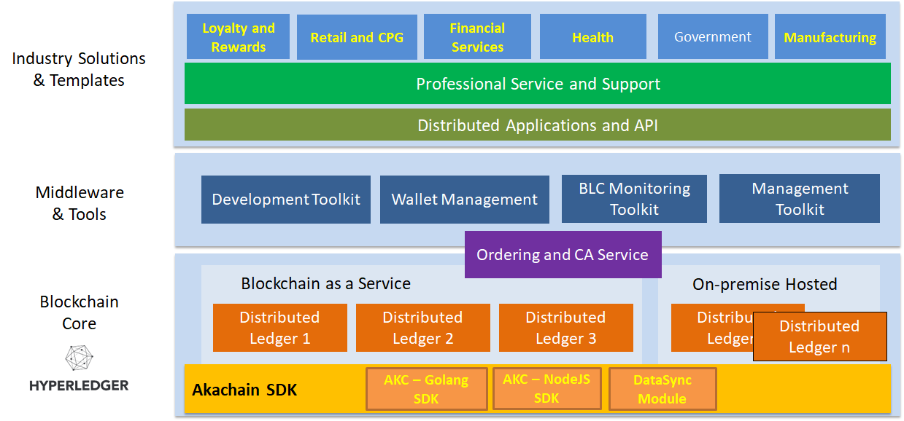

2. Platform landscape
=====================

The Akachain Plaform includes 3 core layers as depicted in the picture above.

2.1. Blockchain core
--------------------

At the lowest layer, the Akachain platform runs on top of **Hyperledger Fabric**. 
Each business runs their own private Distributed Ledger, either hosted on Amazon Web Service or on-premise cloud. 

Akachain provides centralized Ordering Service using Apache Kafka and Identity Service using RootCA to reduce the cost of running those individual ledgers. However, it is possible for businesses to run their own Ordering service on their network.

On top of the stock Hyperledger Fabric, Akachain provides several Software Development Kits (SDKs) that accelerate the process of applications development on Akachain:

1. AKC - Golang SDK: https://github.com/Akachain/akc-go-sdk, The Golang SDK offers a number libraries to help with writing Golang based chaincode on Hyperledger Fabric. Notables lirabries are: Advance Unit Test SDK, High Throughput SDK and High Secure SDK.

2. AKC - NodeJS SDK: https://github.com/Akachain/akc-node-sdk, The NodeJS SDK provides several libraries to assist writing Decentralized Applications (DApp) using NodeJS on Akachain. 

3. AKC - DataSync Module: DApp template that periodically synchronizes Hyperledger Fabric transactions to an external PostgreSQL database to allow better data analytic functions.

2.2. Middleware and Tools
-------------------------

We provide a number of pre-built Middleware and tools support developers and network administrators to develop/deploy/monitor blockchain applications and private Fabric network.

1. Development Toolkit: Take your time and try our `development tool <https://accounts.akachain.io/login?redirectUrl=https://dev.akachain.io&description=Development%20Tool>`_. The tool allows developers to write and upload their chaincode directly to Akachain Test Network with 2 peers. It also automatically exposes REST APIs for DApp to call to those deployed chaincodes.
2. Wallet Management: Akachain provides 
3. Blockchain Monitoring Toolkit:
4. network Management Toolkit:

2.3. Industry Solutions and Templates
-------------------------------------